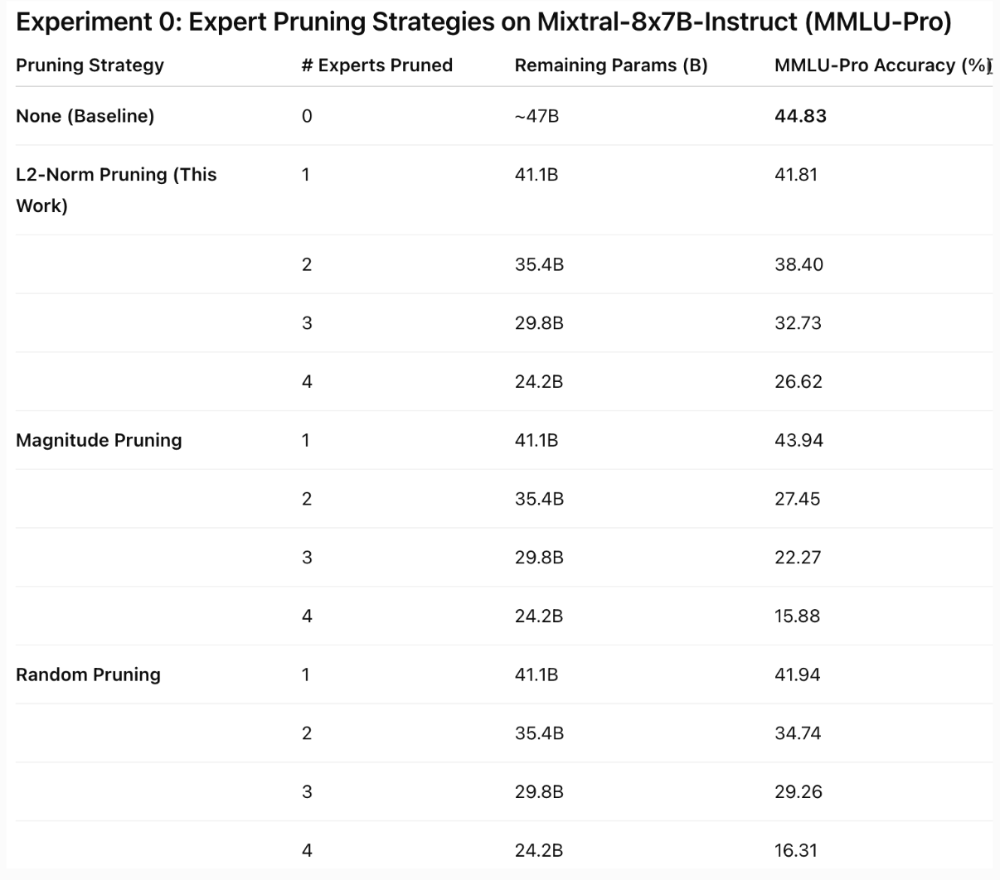
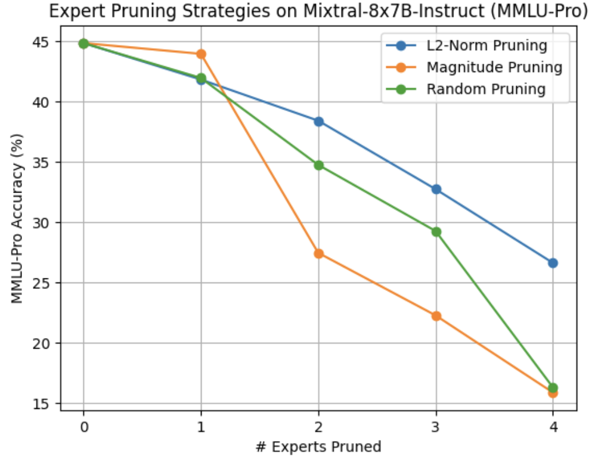

# Mixtral 8x7B Expert Pruning

This project explores expert pruning strategies for the Mixtral 8x7B-Instruct-v0.1 model. We fine-tune the model, analyze expert importance via L2 norm differences, and evaluate pruned models on standard benchmarks.

## Project Structure
```
.
├── fine_tune.ipynb          # Fine-tuning Mixtral 8x7B-Instruct-v0.1
├── experts_pruning/         # Expert selection and pruning methods
├── benchmark_eval/          # Benchmark evaluation scripts
├── eval_results/            # Evaluation results
└── README.md
```

## Pipeline Overview

### 1. Fine-Tuning

Fine-tune the Mixtral 8x7B-Instruct-v0.1 model using `fine_tune.ipynb`. After fine-tuning, we generate heatmaps to visualize the L2 norm differences between experts.

### 2. Expert Selection & Pruning

Based on the L2 norm analysis, we select and prune experts. The code is located in the `experts_pruning/` folder.

We provide two pruning methods:

| Method | File Type | Description |
|--------|-----------|-------------|
| Standard | `.py` | Maintains the same number of safetensors as the base model |
| Ali's Method | `.ipynb` | Produces a different number of safetensors (consolidated) |

> **Note:** Both methods produce models with identical parameters and size—only the safetensor file organization differs.

### 3. Benchmark Evaluation

We evaluate pruned models on two benchmarks located in `benchmark_eval/`:

| Benchmark | Description |
|-----------|-------------|
| MMLU-Pro | Multi-task language understanding evaluation |
| LightEval | Lightweight evaluation framework |

⚠️ **Important:** Each benchmark has different environment requirements. Please refer to the respective subdirectories for setup instructions.

### 4. Results
#### (MMLU-Pro)
**Accuracy vs. Experts Pruned**
<p align="center">
  
</p>

### Summary Table
<p align="center">
  
</p>

All evaluation results are stored in the `eval_results/` folder.


## Getting Started
# Follow the notebooks/scripts in order:

1. fine_tune.ipynb
2. experts_pruning/
3. benchmark_eval/

## Requirements

- Python 3.11 < 3.12
- Additional requirements vary by component (see individual folders)

## Acknowledgments

- [Mixtral 8x7B](https://huggingface.co/mistralai/Mixtral-8x7B-Instruct-v0.1) by Mistral AI
